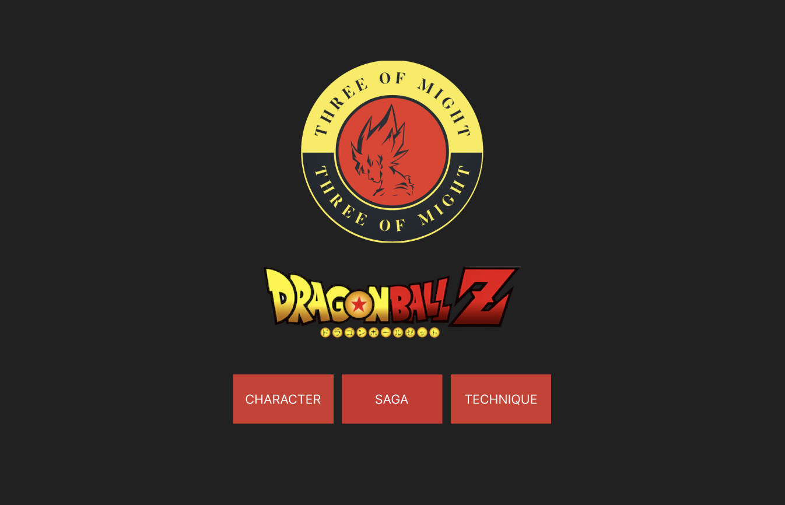
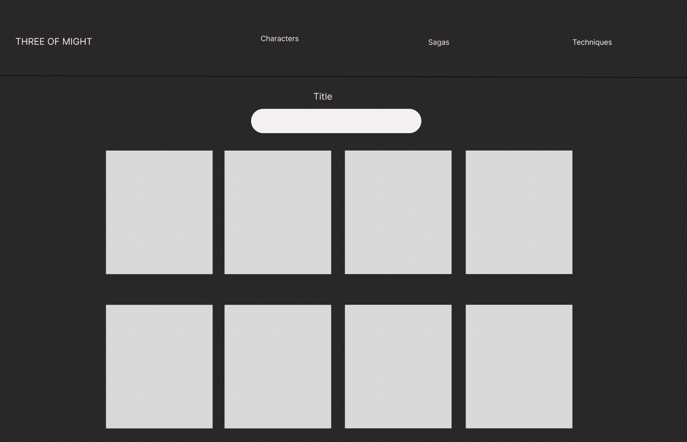

# DragonBall Front-End Project

Ever wanted to know more about Dragonball? Have a visual representation of the characters and sagas? Find a list of Dragonball techniques...?

...Then you've come to the right place! Our collaborative Dragonball project let's you do this!

## Who We Are:
We are team ‘Three of Might’ - 3 members of Cohort 5 from the Bright Network Technology Academy!
- Sabina Rafique 
    - Github: [https://github.com/SabinaRafique],
    - LinkedIn: [https://www.linkedin.com/in/sabina-r-2021321ba/]
- Iman
    - Github: [https://github.com/ImanChaudhry]
    - LinkedIn: [https://www.linkedin.com/in/imanchaudhry/]
- Fiyin
    - Github: [https://github.com/fiyinA29]

## Project Overview:
As part of the Bright Network Technology Academy (BNTA), we were assigned a group project to build the front end of a previously developed back-end API from another BNTA group. This task was aimed at exposing us to the challenges involved in working with an unseen API and developing the front end for it.

We were assigned the DragonBall API created by Team [DragonBallin'](#https://github.com/fred1878/Dragonball_API) which consisted of [Peter](#https://github.com/fred1878), [James](#https://github.com/jamesdpli) and [Mani](#https://github.com/Kozmo119). A copy of the backend project can be found by in the repo under the project_backend folder or by clicking on the ‘DragonBall API’ text which will re-direct you to the backend repo.

This front-end project was built using HTML, CSS and ReactJs.

## Table of Contents:
- [Setup and Instructions for using the Project](#setup-and-instructions-for-using-the-project)
- [WireFrames](#wireframes)
- [Minimum Viable Product (MVP)](#minimum-viable-product-mvp)
- [Extensions](#extensions)
- [Testing](#testing)
- [Further Implementations & Extensions](#further-implementations--extensions)
- [Acknowledgments](#acknowledgments)

## Setup and Instructions for using the Project:
1. Clone this repository by typing the following command into your terminal: `git@github.com:ImanChaudhry/frontend_project.git`
2. Open the backend API in IntelliJ and run the SpringBoot application - this can be found found in the ‘project_backend’ folder
    - Please note, the server port should configure to 8080 by default (if you have another server running on port 8080 please terminate this before trying to connect to the API)
3. Open the front-end project in Visual Studio Code - this can be found in the ‘project_frontend’ folder 
4. Type `npm install (shortcut: npm i)` in your terminal to install the required node modules
5. Please also run the following commands in your terminal to install all the necessary dependencies.  
            `npm i react-router-dom` 
            `npm i react-slideshow-image` 
            `npm i icons` 
            `npm i styled-components` 
6. To run the front-end application, please type ‘npm start’ in your terminal.
    - Please note, the front-end application should run on ‘localhost:3000’ unless you have another application running on this host - if so, you will have the option to run this on another host i.e. localhost:3001. This will not affect the running of the project.

## WireFrames:
  

  

## Minimum Viable Product (MVP):
For our MVP, we wanted to create a website design for the backend DragonBall API with the following features:
- Home, Characters, Sagas and Techniques pages
- Working navbar
- Have the list of characters/sagas/techniques show as cards
- Add a gallery of images with a slide-show animation

## Extensions:
For our extensions, we wanted to implement the following:
- Assign character images to corresponding cards
- Add a search bar with full functionality so that it generates results instantly i.e. if you type the letter g it will filter to show all results including the letter g.
- Add animation to the logo on the front page

## Testing:
- All backend routes were tested via Postman prior to coding the front-end to ensure any bugs were identified before implementation.
- Front-end add/delete buttons were tested in postman to make sure they were working
- This process allowed us to evaluate and verify that our DragonBall project did what it was supposed to do, it highlighted any bugs and improved performance.

## Further Implementations & Extensions:
Here are a few ideas on how we would like to expand on this front-end project:

- Add PUT mapping routes
- Add a light mode/dark mode button
- Implement media queries on the Navbar

## Acknowledgments:
We would like to thank the Bright Network Technology Academy team and especially to Anna, Richard and Iain!
