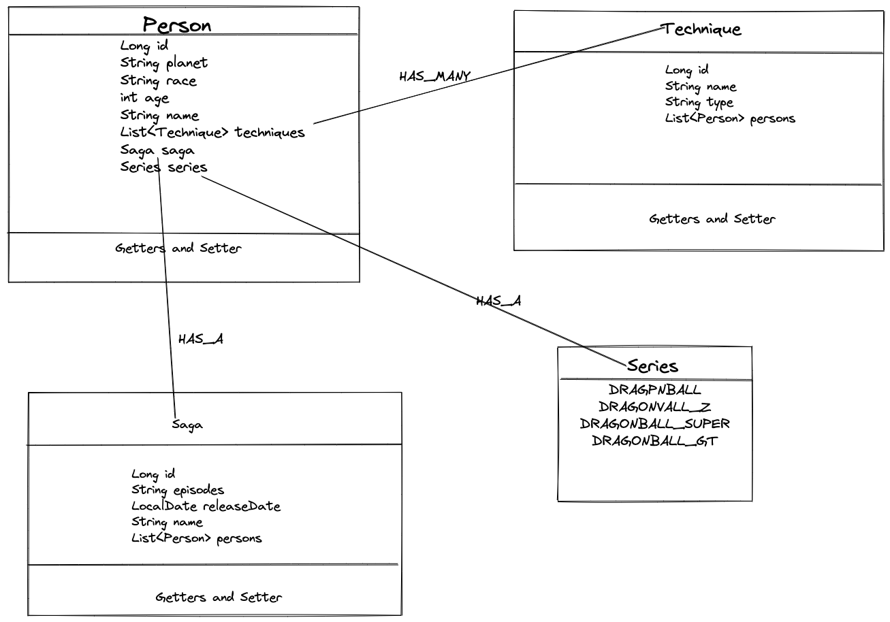
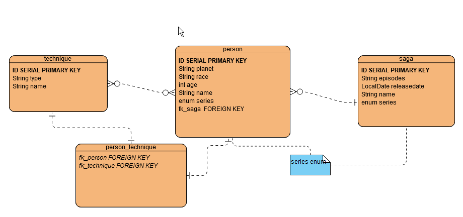
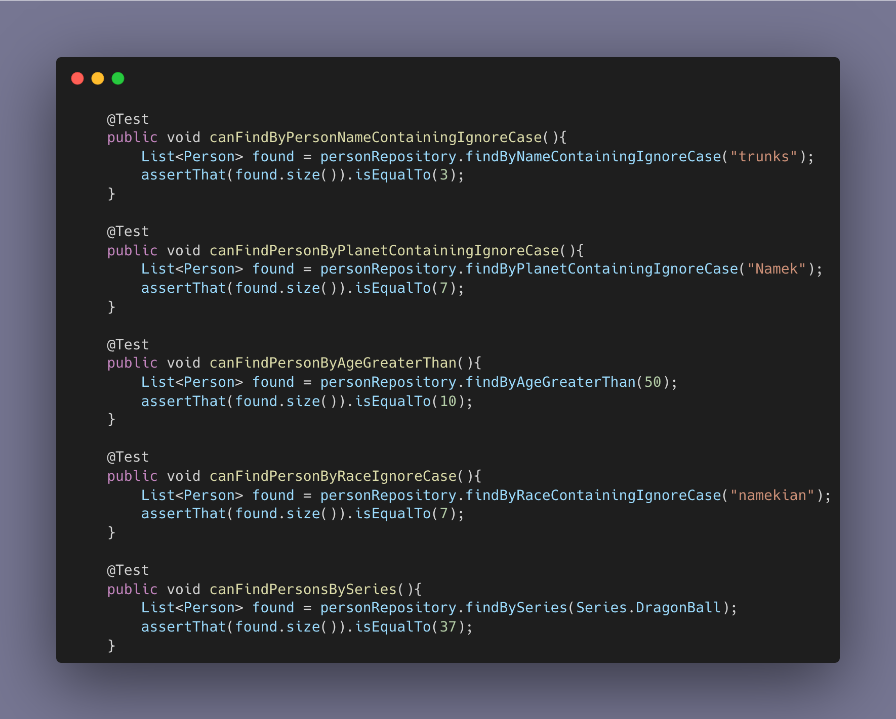

# Dragon Ball API
[//]: # ()

This API features:
1. A Many-To-Many and One-To-Many relationship **(see diagrams)**
2. Derived queries for multiple end-points **(see list)**
3. Full CRUD functionality

## Table of Contents
[Diagrams](##Diagrams) 
[Queries](##Queries) 
[CRUD Functionality](##CRUDFunctionality) 
[Tests](##Tests) 
[Dependencies](##Dependencies) 
[Installation](##Installation)

## Diagrams

### Class Diagram

### Entity Diagram

## Queries

### Persons endpoint

The persons endpoint is located at `localhost:8080/persons` and can be queried with:

1. name **(Case-insensitive)** eg. `localhost:8080/persons?name=Vegeta`
2. planet **(Case-insensitive)** eg. `localhost:8080/persons?planet=Namek`
3. age **(Greater than)** eg. `localhost:8080/persons?age=19`
4. race **(Case-insensitive)** eg.`localhost:8080/persons?race=Human`
5. series **(DragonBall or DragonBall_Z currently)** eg. `localhost:8080/persons?series=DragonBall_Z`

Any combination can be queried at the same time eg. `localhost:8080/persons?name=Goku&age=15&series=DragonBall`

### Techniques endpoint

The techniques endpoint is located at `localhost:8080/techniques` and can be queried with:

1. name **(Case-insensitive)** eg. `localhost:8080/techniques?name=Kamehameha`
2. type **(Case-insensitive)** eg. `localhost:8080/techniques?type=beam`
3. personName **(Case-sensitive, returns techniques used by person)** `eg.localhost:8080/techniques?personName=Krillin`

Any combination can be queried at the same time

### Sagas endpoint

The sagas endpoint is located at `localhost:8080/sagas` and can be queried with:

1. name **(Case-insensitive)** eg.`localhost:8080/sagas?name=Piccolo`
2. releaseDate **(Release date after YYYYMMDD)** eg.`localhost:8080/sagas?releaseDate=20050101`
3. series **(DragonBall and DragonBall_Z currently)** eg. `localhost:8080/sagas?series=DragonBall`
4. personName **(Case-sensitive, returns sagas person features in)** eg. `localhost:8080/sagas?personName=Vegeta`

## CRUD Functionality

Accessing each endpoint with no queries GETs all elements.  

To GET an element by id use `localhost:8080/{endpoint}/{id}`  
To POST to an endpoint use `localhost:8080/{endpoint}` and pass in JSON data, if there is an element with that id an exception will be thrown 
To PUT(update) an element use `localhost:8080/{endpoint}/{id}` and pass in JSON data, if there is no element with that id an exception will be thrown 
To DELETE an element use `localhost:8080/{endpoint}/{id}` if there is no element with that id an exception will be thrown 

## Tests

Tests have been created for all queries   
Below shows examples of tests used for all queries relating to the "persons" route

## Dependencies

Junit and assertj for testing. 
Spring Web 
Spring Boot DevTools 
Spring Data JPA 
H2 Database 

## Installation

1. Clone this repository : `git clone git@github.com:fred1878/Dragonball_API.git`
2. Access the endpoints either in browser with `localhost:8080/{endpoint}`, Postman or H2